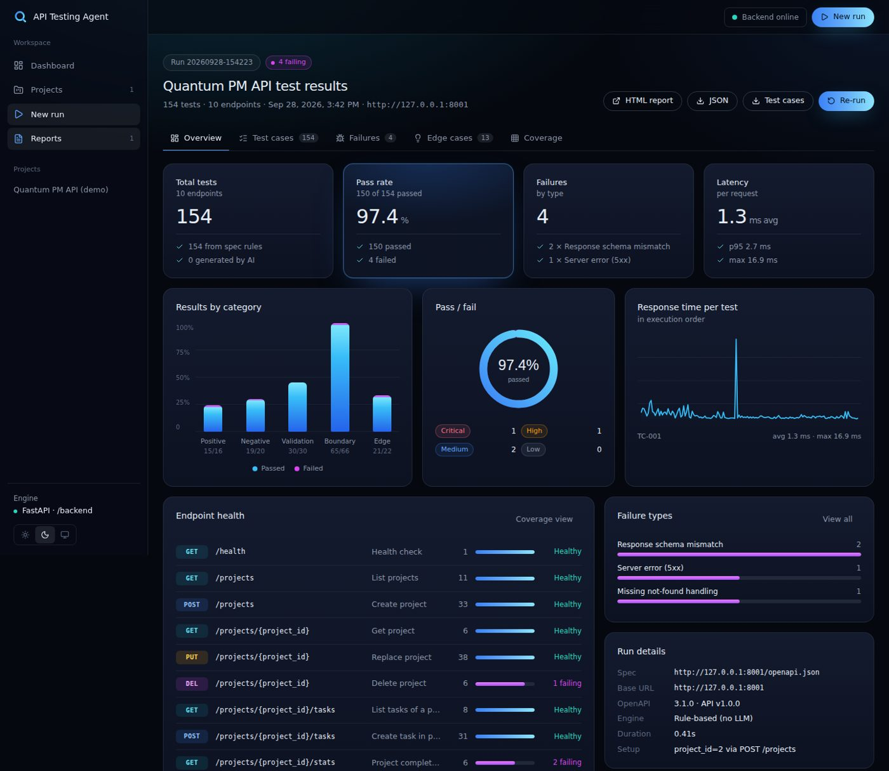
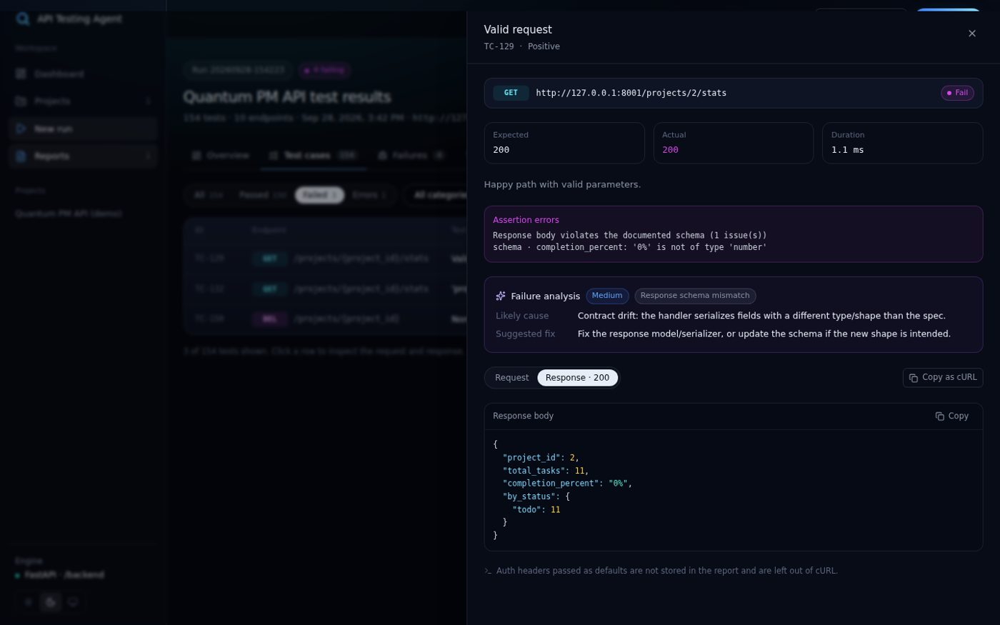
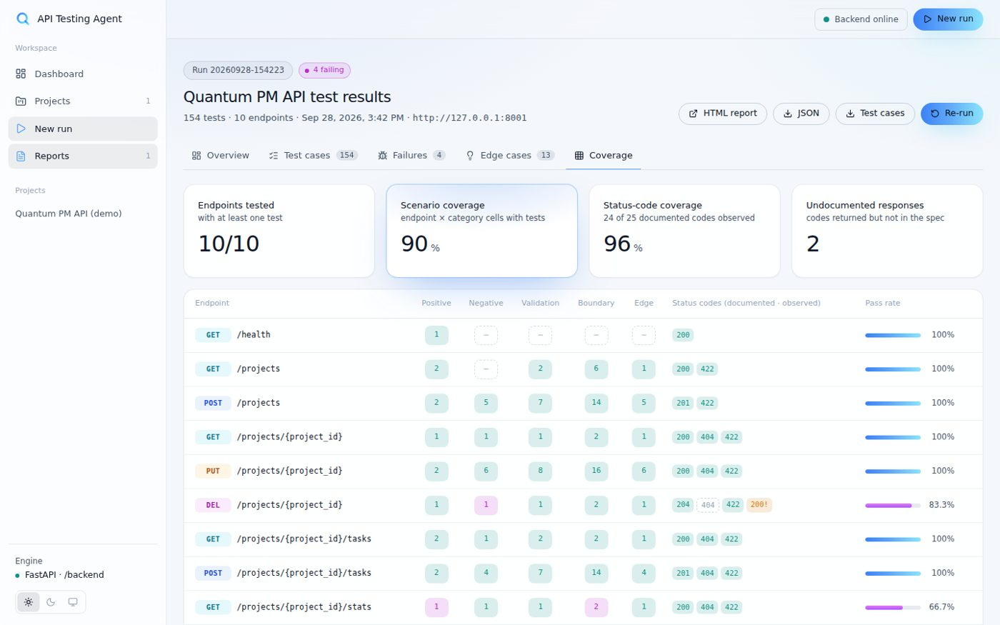

# AI API Testing Agent

Give it an OpenAPI/Swagger spec (or a Postman collection) and it will:

1. **Parse** the endpoints, parameters, request/response schemas and status codes.
2. **Generate** positive, negative, validation, boundary and edge-case tests.
3. **Execute** them against the real API, checking status codes and response schemas.
4. **Analyze** each failure: expected vs actual, likely cause, suggested fix.
5. **Find** uncovered edge cases and suggest the next tests to write.
6. **Report** everything as a web dashboard, an HTML report and JSON.

```
API Specification → Generate Tests → Execute Tests → Analyze Failures → Identify Edge Cases → Test Report
```



## Stack

| Layer | Tech |
|---|---|
| Frontend | Next.js 15 (App Router), React 19, Tailwind CSS 3, TypeScript, lucide-react |
| Backend | Python, FastAPI, httpx, jsonschema, Jinja2, pytest |
| AI (optional) | Anthropic Claude or any OpenAI-compatible API (OpenAI, Groq, Ollama…) |

No database, no auth system, no microservices. The LLM is optional: without a key, the rule-based engine still generates, runs and analyzes everything.

## Quick start

Requirements: **Python 3.10+** and **Node.js 18.18+**.

```bash
# 1. Backend dependencies
cd backend
pip install -r requirements.txt
cp .env.example .env        # optional: add ANTHROPIC_API_KEY or OPENAI_API_KEY
cd ..

# 2. Start everything (demo API :8001, backend :8000, frontend :3000)
python start.py
```

Open **http://localhost:3000**, click **Create demo project**, then **Run tests**.
The first `start.py` run installs the frontend's npm packages automatically.

<details>
<summary>Or start each service yourself (3 terminals)</summary>

```bash
cd backend && uvicorn sample_api.main:app --port 8001   # demo API (optional)
cd backend && uvicorn app.main:app --port 8000          # agent backend
cd frontend && npm install && npm run dev               # UI on :3000
```
</details>

### The demo API

`backend/sample_api` is a small "Quantum PM" project-management API with three planted bugs. The agent finds all three:

| Bug | How it's detected |
|---|---|
| `GET /projects/{id}/stats` returns `completion_percent` as `"40%"` | Response-schema validation |
| `GET /tasks/search` compiles user input as a regex → 500 on `(` | Special-character edge test |
| `DELETE /projects/{id}` returns 200 instead of the documented 404 | Not-found negative test + coverage view |

## Using the UI

| Page | What it does |
|---|---|
| **Dashboard** | Pass-rate trend, latest results, projects, recent runs, backend status |
| **Projects** | Save a spec (URL, OpenAPI file or Postman collection), base URL, auth header and LLM preference per API |
| **New run** | Upload or link a spec, preview the endpoints it contains, run, and watch execution progress |
| **Run report** | Tabs for *Overview*, *Test cases* (filter by status/category/endpoint, search), *Failures* (AI analysis), *Edge cases* and *Coverage* |
| **Reports** | Run history; open any backend run by ID (e.g. `latest` for CLI runs) |

Click any test case to open the **request/response inspector**: URL, parameters, body, response with JSON highlighting, assertion and schema errors, failure analysis, and **Copy as cURL**.



The **Coverage** tab shows an endpoint × scenario matrix and, per endpoint, which documented status codes were observed, which never were, and which returned codes are undocumented.



Dark, light and system themes are available from the sidebar.

## How the frontend talks to the backend

The FastAPI backend is **used unchanged**. The UI integrates with its existing endpoints:

| Backend endpoint | Used for |
|---|---|
| `GET /health` | Online/offline indicator |
| `POST /api/run` (multipart: `spec_url` or `spec_file`, `base_url`, `auth_header`, `use_llm`) | Running the agent |
| `GET /reports/{run_id}/report.json` | Rendering every report view |
| `GET /reports/{run_id}/report.html`, `test_cases.json` | "HTML report" and download buttons |

- **CORS:** the backend has no CORS headers, so `next.config.mjs` proxies `/backend/*` to `BACKEND_URL` (default `http://127.0.0.1:8000`). The browser only ever talks to the Next.js origin. To use a different backend host, set `BACKEND_URL` in `frontend/.env.local`.
- **History:** the backend has no "list runs" endpoint, so projects and run history are stored in the browser's `localStorage`. Reports themselves live in `backend/reports/`.
- **Postman:** collections (v2.x) are converted to OpenAPI 3 in the browser before upload. The converter maps folders to tags, `:id` and `{{var}}` path segments to path params, and JSON bodies and saved example responses to schemas. Postman has no "required" flag, so query params in the saved request count as required, except common optional names such as `limit`, `page` and `sort`.
- **Progress:** `/api/run` is a single synchronous call, so the stage stepper's timing is an estimate while the request is in flight. The elapsed timer, log and final results are real. True streaming would need a backend endpoint (for example SSE), which was out of scope because the backend must stay unchanged.

## CLI and CI (no UI needed)

```bash
cd backend
python demo.py --open                                              # self-contained demo
python -m agent --spec http://localhost:8001/openapi.json          # any spec URL or file
python -m agent --spec api.yaml --base-url https://staging.example.com \
  --header "Authorization: Bearer $TOKEN" --fail-on-failure        # exit 1 on failures
pytest tests/generated -v                                          # replay generated cases in pytest
pytest                                                             # agent unit tests
```

CLI runs appear in the UI via **Reports → Open by run ID → `latest`**.

## LLM configuration (`backend/.env`)

```bash
ANTHROPIC_API_KEY=sk-ant-...        # auto-detected
# LLM_MODEL=claude-sonnet-5

# or any OpenAI-compatible endpoint, e.g. local Ollama:
# LLM_PROVIDER=openai
# OPENAI_BASE_URL=http://localhost:11434/v1
# LLM_MODEL=llama3.1
```

With a key set, the LLM adds up to 5 extra scenarios per endpoint, rewrites failure causes and fixes, and proposes additional edge cases. These are marked **AI** in the UI. If the LLM fails three times, the run continues rule-based.

## Project structure

```
├── start.py                  # one-command launcher
├── backend/                  # FastAPI + agent (unchanged)
│   ├── agent/                # parser, generator, executor, analyzer, edge cases, reporter, LLM client
│   ├── app/main.py           # /api/run, /health, /reports
│   ├── sample_api/           # demo API with planted bugs
│   └── tests/                # unit tests + pytest replay of generated cases
└── frontend/                 # Next.js + Tailwind
    ├── app/                  # dashboard, projects, run, runs/[runId], reports
    ├── components/
    │   ├── ui/               # button, badge, card, controls (tabs, segmented, switch, drawer)
    │   ├── report/           # overview, test-cases, case-detail, failures, edge-cases, coverage
    │   └── …                 # app shell, theme, charts, JSON viewer, spec input, run progress
    └── lib/                  # api client, types (mirror report.json), store, spec + Postman conversion
```

## Extending

- **New test rule:** add it in `backend/agent/generator.py`. It then appears in every view with no frontend change.
- **New report view:** add a component in `frontend/components/report/` and a tab in `app/runs/[runId]/page.tsx`. All data comes from `lib/types.ts`'s `Report`.
- **New import format:** add a converter next to `postmanToOpenApi` in `frontend/lib/spec.ts`.
